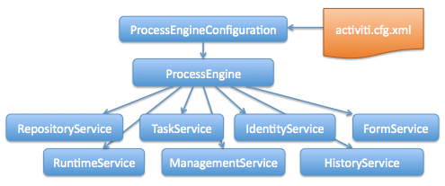

# activiti-demo
> 工作流学习

[how to ask question the smart way.][2]

本项目的是学习工作流引擎 [activiti](https://www.activiti.org/), 本项目使用的是 activiti6.0。

## 画图工具

本项目使用 eclipse 中的 activiti 画图插件来制作工作流，然后再导入到 IdeaJ 中使用。

> Make sure that the file **ends with .bpmn20.xml or .bpmn**, since otherwise the engine won’t pick up this file for deployment.

### [插件安装][1]

**Name**: Activiti BPMN 2.0 designer

**Location**: http://activiti.org/designer/update/

## 原理图




- 官方文档：
  - https://www.activiti.org/userguide/
  - https://www.activiti.org/javadocs/
  - https://github.com/henryyan/activiti-in-action-codes
  - https://xuzhongcn.github.io/activiti/activiti.html
  
- 相关文章

  - https://www.cnblogs.com/xuweiweiwoaini/p/13660394.html

- 数据库配置

  - 缺省配置默认，使用H2内存数据库
  - 配置JDBC属性，使用Mybatis提供的连接池
  - 配置DataSource，可自选第三方实现

- 数据库支持

  | **Activiti database type** | **Example JDBC URL**                                         | **Notes**                                                    |
  | -------------------------- | ------------------------------------------------------------ | ------------------------------------------------------------ |
  | h2                         | jdbc:h2:tcp://localhost/activiti                             | Default configured database                                  |
  | mysql                      | jdbc:mysql://localhost:3306/activiti?autoReconnect=true      | Tested using mysql-connector-java database driver            |
  | oracle                     | jdbc:oracle:thin:@localhost:1521:xe                          |                                                              |
  | postgres                   | jdbc:postgresql://localhost:5432/activiti                    |                                                              |
  | db2                        | jdbc:db2://localhost:50000/activiti                          |                                                              |
  | mssql                      | jdbc:sqlserver://localhost:1433;databaseName=activiti (jdbc.driver=com.microsoft.sqlserver.jdbc.SQLServerDriver) *OR* jdbc:jtds:sqlserver://localhost:1433/activiti (jdbc.driver=net.sourceforge.jtds.jdbc.Driver) | Tested using Microsoft JDBC Driver 4.0 (sqljdbc4.jar) and JTDS Driver |

- 数据库更新策略

  - false: 启动时检查数据库版本，发生不匹配抛异常（**默认**）
  - true: 启动时自动检查并更新数据库表，不存在会创建
  - create-drop: 启动时创建数据库表结构，结束时删除表结构(适合用于单元测试场景)

- MySQL 数据库连接驱动

  ```
  MySQL 5.7: com.mysql.jdbc.Driver
  MySQL 8: com.mysql.cj.jdbc.Driver
  
  jdbcUrl: jdbc:mysql://{ip}:{port}/{db}?characterEncoding=utf8&useSSL=false&serverTimezone=UTC&rewriteBatchedStatements=true
  ```

- 数据源配置

  ```xml
  <bean id="dataSource" class="com.alibaba.druid.pool.DruidDataSource">
          <property name="url"
                    value="jdbc:mysql://localhost:3306/activiti6unit?characterEncoding=utf8&amp;useSSL=false&amp;serverTimezone=UTC&amp;rewriteBatchedStatements=true"/>
          <property name="driverClassName" value="com.mysql.cj.jdbc.Driver"/>
          <property name="username" value="root"/>
          <property name="password" value="root"/>
          <property name="initialSize" value="1"/>
          <property name="maxActive" value="10"/>
          <property name="filters" value="stat, slf4j"/>
      </bean>
  ```

- 作业执行器的配置
  - timeDate: 指定启动时间
  - timeDuration: 指定持续时间间隔后执行
  - timeCycle:R5/P1DT1H 指定事件段后周期执行

### 各种 Service 的使用场景

#### 1. RepositoryService[*]

> RepositoryService的主要功能是：负责对流程定义文件的管理，主要操作静态文件，如流程文件xml, 流程图片。涉及到两个实体对象，部署对象和资源对象。

- 管理**流程定义文件xml**及**静态资源**的服务
- 对特定流程的暂停和激活
- 流程定义启动权限管理
- 部署文件构造器 DeploymentBuilder
- 部署文件查询器 DeploymentQuery
- 流程定义文件查询对象 ProcessDefinitionQuery
- 流程部署文件对象 Deployment
- 流程定义文件对象 ProcessDefinition
- 流程定义的 Java 格式 BpmnModel

#### 2. TaskService[*]

> TaskService的主要功能是：对人工任务进行CRUD操作。对用户任务设置指定的用户权限，指定到用户到用户组。同时对于用户任务的上下文一些变量进行设置或获取。

- 对用户任务管理和流程的控制
  - Task对象创建，删除
    - 一般很少手动执行创建，一般直接在流程定义中完成这件事情
    - 当任务完成流转到下个节点的时候删除
  - 查询Task，并驱动Task节点完成执行
  - Task 相关参数变量设置
- 设置用户任务 UserTask 的权限信息(拥有者，候选人，办理人)
  - 候选用户 candidateUser 和候选组 candidateGroup
  - 指定用有人 Owner 和办理人 Assignee
  - 通过 claim 设置办理人
- 针对用户任务添加任务附件，任务评论和事件记录
  - 任务附件 Attachment 创建与查询，报销单等
  - 任务评论 Comment 创建与查询
  - 事件记录 Event 创建与查询

#### 3. IdentityService[*]

> IdentityService的主要功能是：对用户和用户组的管理。

- 管理用户 User，CRUD
- 管理用户组 Group, CRUD
- 用户与用户组的关系，**多对多**，**一个用户可以属于多个组，一个用户组也可以包含多个用户**。

#### 4. FormService[*]

> FormService的主要功能是：解析流程定义中的表单。对表单的输入类型，格式进行数据渲染。启动表单，User Task 里的表单。

- 解析流程定义中表单项的配置
- 提交表单的方式驱动用户节点流转
- 获取自定义外部表单 key

#### 5. RunTimeService[*]

> RunTimeService的主要功能是：对流程进行控制的一个服务API，可以用它启动一个流程实例。根据指定的流程实例执行暂停，挂起或继续激活执行。包括很多丰富的查询API. 可以查到运行的流程实例和运行对象。同时对流程中上下文数据进行设置和获取。

- 启动流程及对流程数据的控制
- 流程实例 ProcessInstance 与执行流 Execution 查询
- 触发流程操作，接收消息和信号
- 启动流程及变量管理
  - 启动流程的常用方式，id, key and message
  - 启动流程可选参数 businessKey, variables and tenantId。tenant. 房客；租户；佃户
  - 变量的设置和获取
- 流程实例与执行流
  - 流程实例 ProcessInstance 表示一次工作流业务的数据实体
  - 执行流 Execution 表示流程实例中具体的执行路径，这种情况下 两者 Id 一致
  - 流程实例接口继承与执行流
- 流程运行控制服务
  - 使用 Trigger 触发 ReceiveTask 节点
  - 触发信号捕获事件 signalEventReceived，全局发送
  - 触发消息捕获事件 messageEventReceived，针对某个消息实例发消息

#### 6. ManagementService[*]

> ManagementService的主要功能是：对流程引擎基础的一些管理，提供了对定时任务Job的一些管理，提供了获取数据库表名的一些方法。

- Job 任务管理
  - JobQuery: 查询一般工作
  - TimerJobQuery: 查询定时工作
  - SuspendedJobQuery: 查询终端工作
  - DeadLetterJobQuery: 查询无法执行的工作
- 数据库相关通用操作，数据库中有多少张表以及表的 metadata 数据
  - 查询表结构元数据
  - 通用表查询
  - 执行自定义SQL查询
- 执行流程引擎命令 Command

#### 7. HistoryService[*]

> HistoryService的主要功能是：提供了对运行结束的流程实例的一些查询功能，也提供了流程，用户任务维度的删除操作。便于统计流程中的变化。获取流程上下文中的快照数据。

- 管理流程实例结束后的历史数据
- 构建历史数据的查询对象
  - 创建 历史数据实体 查询
  - 创建 Native 历史数据实体 查询
  - createProcessInstanceHistoryLogQuery
- 根据流程实例Id删除流程历史数据
  - deleteHistoricProcessInstance
  - deleteHistoricTaskInstance
- 历史管理服务实体
  - HistoricProcessInstance: 历史流程实例实体类
  - HistoricVariableInstance: 流程或任务变量值的实体
  - HistoricActivityInstance: 单个活动节点执行的信息
  - HistoricTaskInstance: 用户任务实例的信息
  - HistoricDetail: 历史流程活动任务详细信息

#### 8. DynamicBpmService

> DynamicBpmService的主要功能是：可以对动态的流程模型做修改。activiti6.0 new feature


### Acticiti 异常策略

- AcitivitiWrongDbException: 引擎与数据库版本不匹配
- AcitivitiOptimisticLockingException: 并发导致乐观锁异常
- ActivitiClassLoadingException: 加载类异常
- ActivitiObjectNotFoundException: 操作对象不存在
- ActivitiIllegalArgumentException: 非法参数
- ActivitiTaskAlreadyClaimedException: 任务重新声明代理人
- BpmnError: 定义业务异常，控制流程

- ActivitiException: 在 Activiti 里最大的异常


### DB Design of Activiti6.0

- ACT_GE_*: 通用数据表
  - ACT_GE_PROPERTY: 属性表（保存流程引擎的KV键值属性）, 对应实体类(**org.activiti.engine.impl.persistence.entity.PropertyEntityImpl**)
  - ACT_GE_BYTEARRAY: 资源表（存储六i成定义相关的资源）, 对应实体类(**org.activiti.engine.impl.persistence.entity.ByteArrayEntityImpl**)
- ACT_RE_*: 流程定义存储表
  - ACT_RE_DEPLOYMENT: 流程部署记录表，对应实体类(**org.activiti.engine.impl.persistence.entity.DeploymentEntityImpl**)
  - ACT_RE_PROCDEF: 流程定义信息表，对应实体类(**org.activiti.engine.impl.persistence.entity.ProcessDefinitionEntityImpl**)
  - ACT_RE_MODEL: 模型信息表（用于WEB设计器）, 对应实体类(**org.activiti.engine.impl.persistence.entity.ModelEntityImpl**)
  - ACT_PROCDEF_INFO: 流程定义动态改变信息表，对应实体类(**org.activiti.engine.impl.persistence.entity.ProcessDefinitionInfoEntityImpl**)
- ACT_ID_*: 身份信息表
  - ACT_ID_USER: 用户的基本信息，对应实体表(**org.activiti.engine.impl.persistence.entity.UserEntityImpl**)
  - ACT_ID_INFO: 用户的扩展信息，对应实体表(**org.activiti.engine.impl.persistence.entity.IdentityInfoEntityImpl**)
  - ACT_ID_GROUP: 群组，对应的实体表(**org.activiti.engine.impl.persistence.entity.GroupEntityImpl**)
  - ACT_ID_MEMBERSHIP: 用户与群组的关系表，对应的实体类(**org.activiti.engine.impl.persistence.entity.MembershipEntityImpl**)
- ACT_RU_*: 运行时数据库表
  - ACT_RU_EXECUTION: 流程实例与分支执行信息，对应的实体类(**org.activiti.engine.impl.persistence.entity.ExecutionEntityImpl**)
  - ACT_RU_TASK: 用户任务信息，对应的实体类(**org.activiti.engine.impl.persistence.entity.TaskEntityImpl**)
  - ACT_RU_VARIABLE: 变量信息，对应的实体类(**org.activiti.engine.impl.persistence.entity.VariableInstanceEntityImpl**)
  - ACT_RU_IDENTITIYLINK: 参与者相关信息，对应的实体类(**org.activiti.engine.impl.persistence.entity.IdentityLinkEntityImpl**)
  - ACT_RU_EVENT_SUBSCR: 事件订阅信息表，对应的实体类(**org.activiti.engine.impl.persistence.entity.EventSubscriptionEntityImpl**)
  - ACT_RU_JOB: 作业表，对应的实体类(**org.activiti.engine.impl.persistence.entity.JobEntityImpl**)
  - ACT_RU_TIMER_JOB: 定时器表(**org.activiti.engine.impl.persistence.entity.TimerJobEntityImpl**)
  - ACT_RU_SUSPENDED_JOB: 暂停作业表，对应的实体类(**org.activiti.engine.impl.persistence.entity.SuspendedJobEntityImpl**)
  - ACT_RU_DEADLETTER_JOB: 死信表，对应的实体类(**org.activiti.engine.impl.persistence.entity.DeadLetterJobEntityImpl**)
- ACT_HI_*: 历史数据库表
  - ACT_HI_PROCINST: 历史流程实例表，对应实体类(**org.activiti.engine.impl.persistence.entity.HistoricProcessInstanceEntityImpl**)
  - ACT_HI_ACTINST: 历史节点信息表，对应实体类(**org.activiti.engine.impl.persistence.entity.HistoricActivityInstanceEntityImpl**)
  - ACT_HI_TASKINST: 历史任务表，对应实体类(**org.activiti.engine.impl.persistence.entity.HistoricTaskInstanceEntityImpl**)
  - ACT_HI_VARINST: 历史变量表，对应实体类(**org.activiti.engine.impl.persistence.entity.HistoricVariableInstanceEntityImpl**)
  - ACT_HI_IDENTITYLINK: 历史参与表，对应实体类(**org.activiti.engine.impl.persistence.entity.HistoricIdentityLinkEntityImpl**)
  - ACT_HI_DETAIL: 历史变更，对应实体类(**org.activiti.engine.impl.persistence.entity.HistoricDetailEntityImpl**)
  - ACT_HI_ATTACHMENT: 附件，对应实体类(**org.activiti.engine.impl.persistence.entity.AttachmentEntityImpl**)
  - ACT_HI_COMMENT: 评论，对应实体类(**org.activiti.engine.impl.persistence.entity.CommentEntityImpl**)
  - ACT_EVT_LOG: 事件日志，对应实体类(**org.activiti.engine.impl.persistence.entity.EventLogEntryEntityImpl**)，建议使用MongoDB 或者 ES 存储相关的数据

### [BPMN2.0规范][3]

- [BPMN Poster][4]

  

- 一套业务流程模型与符号建模标准
- 精准的执行语义来描述元素的操作
- 以XML为载体，以符号可视化业务

- 组成

  - 数据

    - 数据对象(Data Objects)
    - 数据输入对象(Data Input Objects)
    - 数据输出对象(Data Output Objects)
    - 数据存储(Data Store)

  - 泳道(Swimlanes)

    

    - 对业务范围的一个界定，一般通过不同的角色去做区分
    - 池(Pools)
      - **一个角色对应一个道**，一个池子里有多个泳道
    - 道(Lanes)

  - 描述对象

    

    - 并不影响流程的进行，为流程图的可读性做了一定程度的描述
    - 组
    - 单组节点做注释

  - 流对象

    - 最重要，包括活动，事件和网关

    - 活动(Activities)

      

      - 用户任务(User Task)
      - 子流程(Sub-Process)

    - 事件(Events)

      

      

      

      

      - 开始事件(Start Event)
      - 中间事件(Intermediate Event)
      - 结束事件(End Event)

    - 网关(Gateways)

      

      - 单一网关(Exclusive Gateway)
      - 并行网关(Parallel Gateway)
      - 多路网关(Inclusive Gateway)

  - 连接对象(Connecting Objects)

    

    - 流对象通过连接对象连接起来表示数据的流转
    - 顺序流(Sequence Flows)
    - 关联(Associations)
    - 数据关联(Data Associations)
    - 消息流(Message Flow)

### 工作流平台搭建

#### 需求

- 支持流程定义文件在线设计，部署和维护
- 支持自定义表单与流程定义的集成
- 流程运行的用户及权限管理功能
- 监控流程运行过程和历史数据
- 平台与第三方系统集成，通常对外提供接口

#### 技术实现

- 基于 activiti-ui 工程开发
- 基于 activiti-engine 自己搭建

### 相关 Maven 命令

```shell
# 常用 Maven 命令行命令
mvn versions:set -DnewVersion=6.0.0-boot2
mvn clean install source:jar -Dmaven.test.skip=true
mvn clean tomcat7:run
```


[1]:https://www.activiti.org/userguide/#eclipseDesignerInstallation
[2]:http://www.catb.org/~esr/faqs/smart-questions.html
[3]: https://www.activiti.org/userguide/#bpmn20
[4]: http://www.bpmb.de/images/BPMN2_0_Poster_CHN.PDF

